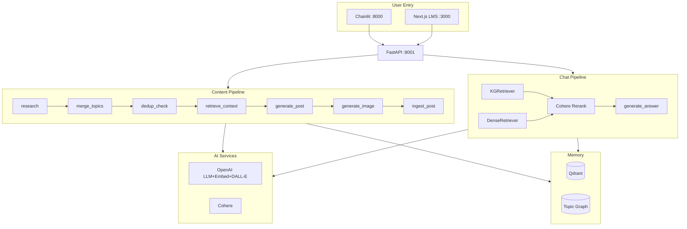

# Gamma.app Presentation Prompt — Zizi Byte

**Copy this entire prompt into [Gamma.app/create](https://gamma.app/create)** when creating a new AI-generated presentation. Adjust tone or length as needed.

---

## PROMPT START

Create a **stellar, professional presentation** for **Zizi Byte** — an Adaptive AI Micro-Learning Platform. Tagline: *"Learn in bytes. Think in leaps."*

**Visual style:** Dark theme (charcoal/black background), high contrast, modern sans-serif typography. Use glowing neon accents (teal, purple, amber) for data flows and key components—similar to a futuristic AI/tech product deck. Include **captivating, high-quality AI-generated images** that illustrate: micro-learning concepts, knowledge graphs, analogy-driven education, and AI-powered content creation. Each content slide should balance **stunning visuals** (left or right 40%) with **structured, scannable text** (right or left 60%).

---

## SLIDE 1 — Title

**Zizi Byte**  
*Enterprise AI Micro-Learning Platform*

*Learn in bytes. Think in leaps.*

[Use a split layout: left = title + tagline on dark background; right = futuristic illustration showing interconnected nodes (knowledge graph), glowing data streams, and a learner engaging with byte-sized cards—vibrant teal/purple/amber palette.]

---

## SLIDE 2 — The Problem

**The Learning Retention Nightmare**

**Persona:** Alex — Working professional upskilling in AI engineering, enrolled in a technical bootcamp.

**Scenario:** Each session is 50–200 slides plus Jupyter notebooks. By Monday, Thursday's concepts are gone. Worse — they can't connect Week 3's agent loop to Week 11's reranking, even though they're deeply related.

**Bullet points (in 2x2 or 2x3 grid with icons):**
- **Retention** — Concepts fade within days without active recall
- **Connection** — Topics build on each other, but learners rarely see the threads
- **Application** — Abstract concepts need personal, meaningful entry points
- **Knowledge Silos** — Undocumented expertise, fragmented docs
- **Generic Tools** — ChatGPT has no access to actual course material
- **Manual Search** — Google returns pages, not course-grounded explanations

[Image: Person at desk surrounded by multiple screens showing dense slides and notebooks, looking overwhelmed—glowing green/yellow data streams suggesting chaos. Dark, high-contrast.]

---

## SLIDE 3 — Key Value Propositions

**What Zizi Byte Delivers**

[2x2 grid, each block with icon + bold title + 2–3 bullet points:]

1. **Analogy-First Learning**  
   - Every concept explained through vivid, relatable analogies first  
   - "Agent tools = superhero's gadget belt"; "RAG = librarian finding the right book"  
   - Technical detail follows—grounded in course material  

2. **Multi-Hop Knowledge Graph**  
   - D3 force-directed galaxy of course topics and connections  
   - KGRetriever traverses BUILDS_ON edges up to 2 hops  
   - Connects embeddings (Module 02) to reranking (Module 11) explicitly  

3. **Strictly Grounded Answers**  
   - Every claim cited by source file (e.g., AIE9_Session03_The-Agent-Loop.pdf)  
   - No fabrication—if context is weak, system says so  
   - RAG over 1,197 chunks from 20 course files  

4. **Three Modes, One Platform**  
   - **LMS** — Byte cards, Build mode (notebook code), Share (LinkedIn)  
   - **Content Creator** — Research → Dedup → RAG → Post + DALL-E image  
   - **Chat** — KG+Dense → Cohere Rerank → Analogy-first streaming  

[Image: Vibrant rocket or upward-trending visualization suggesting growth/launch—rainbow gradient, energetic. Or: Split screen showing Galaxy view + byte card.]

---

## SLIDE 4 — Architecture Overview

**Zizi Byte Architecture**

[Use an **architecture diagram** with clear components and data flow. Reference the style: distinct colored boxes, labeled arrows, hierarchical grouping. Key elements to include:]

**User Entry Points:**
- **Chainlit** (port 8000) — Intent routing: `create` | `kg` | `learn` | `chat`
- **Next.js LMS** (port 3000) — Galaxy (D3), /learn, /chat, Build mode
- **FastAPI Bridge** (port 8001) — REST + SSE streaming

**Pipelines (LangGraph):**
- **Content Pipeline:** research (Tavily + X.com) → merge_topics → **dedup_check (AGENTIC)** → retrieve_context → generate_post → generate_image → ingest_post
- **Chat Pipeline:** KGRetriever (k=15) + DenseRetriever (k=15) → Merge → Cohere Rerank (top 8) → Analogy-first stream
- **Byte Pipeline (LMS):** check_cache → analogy_generator → fan-out (image, animation, TTS) → persist

**AI Services:** OpenAI (LLM gpt-4o-mini, Embeddings text-embedding-3-small, DALL-E 3 HD), Cohere (Rerank v3.5)

**Memory:** Qdrant (course_knowledge_base, generated_posts), NetworkX Topic Graph, SQLite Analogy Store

**Tools:** Tavily, X.com

[Diagram style: Clean boxes, color-coded sections (teal=entry, purple=agents, amber=AI, green=memory), arrows with labels. Dark background, neon accents.]

---

## SLIDE 5 — User Journey: Learning a Concept

**User Journey: "Explain the agent loop like I'm 5"**

[6-step vertical flow with chevrons or numbered blocks—similar to SREnity's "P1 Alert at 3 AM" journey:]

1. **Select Topic** — User clicks "The Agent Loop" in the D3 Galaxy
2. **Request Byte** — System calls FastAPI `/api/bytes/generate`
3. **Retrieval** — DenseRetriever fetches k=10 chunks from Qdrant
4. **Analogy Generation** — GPT-4o generates mechanism-research → vivid analogy → explanation → "why it matters"
5. **Media Generation** — Parallel: DALL-E image, Remotion animation props, OpenAI TTS
6. **Deliver** — Byte card with analogy, explanation, image, sources—all grounded in course material

[Optional sub-bullets under each step for technical detail.]

---

## SLIDE 6 — User Journey: Content Creation + Dedup

**User Journey: Creating a LinkedIn Post**

[6-step flow:]

1. **Trigger** — User types `create` in Chainlit
2. **Research** — Tavily + X.com fetch trending AI topics in parallel
3. **Topic Selection** — LLM picks the hottest, most specific topic
4. **Dedup Check (AGENTIC)** — Embeds topic, searches Qdrant posts. If cosine similarity > 0.85 → **halt**, inform user. Else → continue.
5. **RAG + Generation** — Dense retrieval grounds post in course KB. GPT-4o generates Hook→Analogy→Tech→CTA. DALL-E 3 HD creates poster.
6. **Ingest** — Post stored in Qdrant, Knowledge Graph updated with new topic node.

*Key differentiator: The dedup_check_node is a LangGraph conditional edge—runtime decision, no human in the loop.*

---

## SLIDE 7 — Retrieval Stack & RAG

**RAG Stack: How Chat Gets Grounded Answers**

[Clear flow or 2-column layout:]

**Retrieval (parallel):**
- **KGRetriever** — Embed query → cosine-match topic nodes in NetworkX → traverse edges (2 hops) → Dense retrieval on original query + each related topic → merge
- **DenseRetriever** — Raw query embed → Qdrant k=15

**Critical fix:** ALL unique chunks (~25–30) passed to Cohere—not pre-filtered by embedding score. This prevents exact-match docs (e.g., Session03 PDF at 0.47 cosine) from being cut before Cohere's neural reranker surfaces them.

**Rerank:** Cohere rerank-v3.5 → top 8

**Generation:** GPT-4o-mini streams answer using ONLY retrieved context. System prompt forbids pre-trained knowledge. Analogy-first structure: 🎯 Analogy → ⚙️ Technical → 💡 Why it matters → ❓ Follow-up question.

---

## SLIDE 8 — Evaluation & Results

**RAGAS Evaluation (Session 10)**

| Metric | Dense (Baseline) | HyDE | Delta |
|--------|------------------|------|-------|
| Context Recall | 0.59 | 0.63 | +6.9% |
| Faithfulness | 0.37 | **0.48** | **+28%** |
| Answer Relevancy | 0.39 | **0.52** | **+33%** |

**Module 11 — Full strategy comparison:** Semantic Chunking wins (composite 2.261). Naive Dense 2.237—only 1.1% behind, validating 512-char chunking.

**Production chat:** KG+Dense → Cohere Rerank (not Dense or HyDE alone). Multi-hop breadth + neural reranking = best pedagogical + precision balance.

---

## SLIDE 9 — Tech Stack

**Built With**

[Clean grid or list with logos/badges if possible:]

- **Orchestration:** LangGraph (StateGraph, conditional edges)
- **LLM & Embeddings:** OpenAI (gpt-4o-mini, text-embedding-3-small)
- **Vector DB:** Qdrant (Docker)
- **Knowledge Graph:** NetworkX + JSON
- **Reranking:** Cohere rerank-v3.5
- **Search:** Tavily, X.com (tweepy v2)
- **Image:** DALL-E 3 HD
- **Frontend:** Next.js 14, D3.js, framer-motion, Zustand
- **API:** FastAPI, SSE streaming
- **Evals:** RAGAS 0.2.x, SingleTurnSample
- **Package manager:** uv

---

## SLIDE 10 — Future State

**Roadmap**

[3 sections with bullet points—similar to "Future State" reference:]

**1. Proactive Learning**
- Pre-generate bytes for popular topics (warm cache)
- Push byte cards on schedule (WhatsApp, email)
- Personalized learning paths based on progress

**2. Enhanced Context**
- Multi-cohort KB — ingest from any course
- Learner profile — ask profession → adapt analogies
- Historical learning patterns and retention metrics

**3. Extensible Platform**
- Semantic Chunking upgrade (best RAGAS composite)
- LinkedIn API — one-click publish
- Public deployment: Vercel + Railway

---

## SLIDE 11 — Demo

**Demo**

[Single word "Demo" centered, large, bold white on black—minimalist, impactful. Or: Screenshot of Galaxy + byte card side by side.]

---

## SLIDE 12 — Thank You

**Thank You**

*Zizi Byte — Learn in bytes. Think in leaps.*

[Clean, centered. Black background, white text. Optional: Zizi Byte logo or small tagline.]

---

## PROMPT END

---

## Additional Instructions for Gamma.app

1. **Image generation:** For each slide that needs a visual, prompt Gamma to create images that are: *futuristic, high-tech, data-visualization-oriented, with glowing teal/purple/amber elements*. Avoid generic stock photos. Prefer conceptual illustrations (knowledge graphs, data flows, learners with tech).

2. **Architecture diagram (Slide 4):** Open `docs/zizi-byte-architecture.drawio` in [draw.io](https://app.diagrams.net/) — has flow animation on arrows. Or use `docs/zizi-byte-architecture.excalidraw` in [Excalidraw](https://excalidraw.com). Otherwise, describe: *"Professional architecture diagram with labeled boxes for User Entry (Chainlit, Next.js, FastAPI), Pipelines (Content, Chat, Byte), AI Services (OpenAI, Cohere), Memory (Qdrant, Topic Graph). Arrows show data flow. Dark theme, neon accents."*

3. **Consistency:** Use the same color palette throughout—charcoal/black background, white/light gray text, teal/purple/amber for accents and highlights.

4. **Cohort sessions applied:** Optionally add a slide: "AIE9 Sessions Applied" — Session 02 (embeddings), 03 (LangGraph, agent loop), 04 (conditional edges), 05 (multi-agent), 06 (memory), 08 (DALL-E), 10 (RAGAS), 11 (advanced retrieval).

---

## Appendix: Mermaid Architecture Diagram (for export)

Use this in Mermaid-compatible tools (Notion, GitHub, Excalidraw, etc.) or to generate a static diagram:

